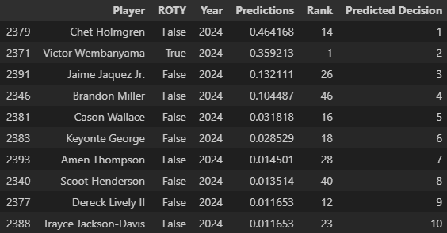
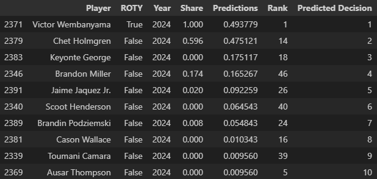
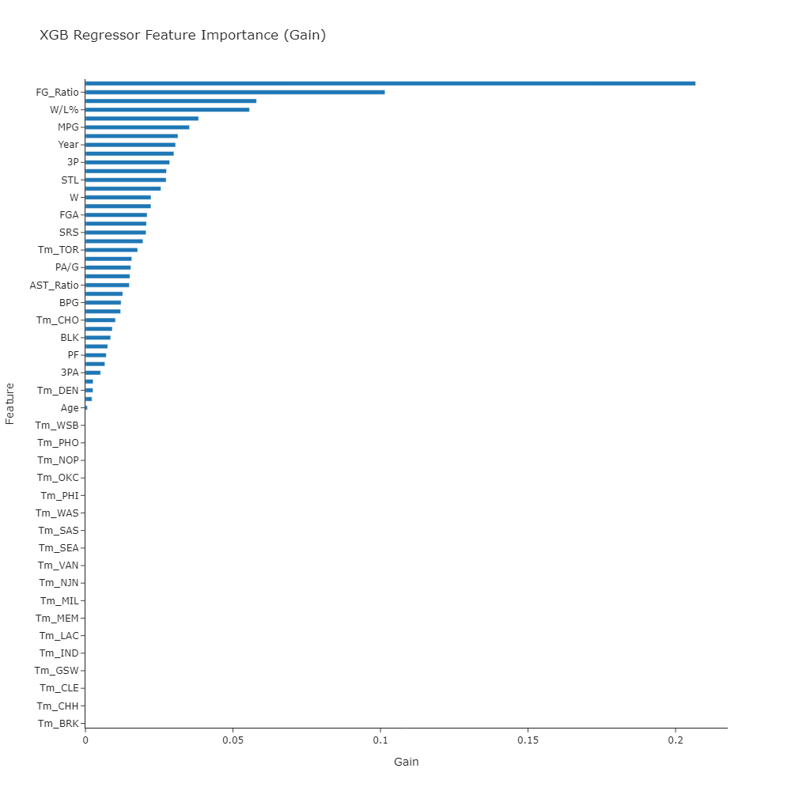
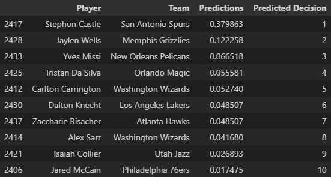

# NBA Rookie of the Year Predictor Project

## Objective 
To predict the winner of the annual NBA Rookie of the Year award by attempting to correctly allocate vote shares. The player that recieves the highest amount of shares wins the award. Most times, there is a clear favorite for Rookie of the Year. However there are some seasons where the talent is distributed more equally, making it more difficult to pin down who will win. 

My approach to this project was to see how accurate my model can predict the winner by focusing on tuning an XGB Regressor model. Linear regression is the logical model choice for this problem due to the amount of independent and dependent variables in the dataset as well as the fact that linear regression models are typically chosen for predictive problems.

This project was inspired by [Dataquest](https://www.youtube.com/watch?v=JGQGd-oa0l4&t=0s)

## Dataset
This dataset was compiled through web scraping https://www.basketball-reference.com. The total combined dataset after basic data cleaning contains 3,439 rows and 41 columns.

## Web Scraping
- The list of all incoming rookies and their total stats was scraped using the Selenium library.
- The data for team standings and data for the winners of the rookie of the year award were scraped using the Requests library and parsed with the BeautifulSoup library.
- All scraping was done ethically with a randomized lag timer in between requests to not overload the websites.

## Data Cleaning
Once all the data was parsed and scraped, I began doing some basic data cleaning and reformatting each seperate dataframe before merging them such as:
1. Rookie of the Year dataset
   - Only kept Player, Points Won, Points Max, Share, Year columns to be merged later.

2. Rookies dataset
   - Deleted extra overheader rows that remained after parsing the html.
   - Reformatting column values to remove special characters for player names.
   - Checked for and removed duplicate entries.
   - Removed the Rank column.
   - Applied a lambda function to retrieve the team abbreviation that the rookie played for.
   - Filled all null values with 0.
   - Reformatted to remove extra whitespace.
  
3. Team Standings dataset
   - Removed special characters from team names
   - Checked for null values.
   - Created a dictionary to match team names with the abbreviations from the Rookie of the Year dataset.
  
4. Merged dataset
   - Removed any rows with null values in the Player column.
   - Replaced the "-" symbol in the games back column with 0.
   - Converted the data types to be numeric with the exception of player and debut.
   - Renamed the per game columns to remove the ".1" suffix.
   - Saved as a .csv file.

## Exploratory Data Analysis
- Deleted Years column.
- Created a dataframe that contained all leading scorers among rookies since 1980.
- Filled all null percentage values with 0.
- Created a histogram to view minutes distribution among rookies.

## Data Preprocessing
- Created new columns that display a ratio of per game stats with the mean of that year.
- Label encoded the Team column.
- Added a boolean ROTY column for validation.
- Applied a MinMaxScaler to normalize the numerical data.
- Created and applied cutoffs for points per game and minutes per game.
- Created a training, validation, and testing dataset. Training is every season from 1980-2023, validation is cutoff from April 2024, and testing is current data from the 2024-2025 NBA season.

## Model Creation and Tuning
I chose the XGB Regressor model for this project. Linear regression models made the most sense, as this is a predictive problem with a large number of independent variables including total and per game stats. XGBoost is an industry leading model, so using their regression model as a baseline seemed like the correct choice. These were the parameters I used for the baseline XGB Regressor Model:
 ```python
 objective = 'reg:squaredlogerror',
 n_estimators = 10,
 seed = 123,
 eval_metric=mean_absolute_error
 ```
These were the 10 players that the model distributed the most shares to, the top player would be considered the choice for Rookie of the Year:



During the voting process for the 2023-2024 season, Victor Wembanyama was the clear favorite to win for the majority of the year. This is mainly attributed to breakout performances throughout the year and incoming hype as the next generational prospect for the league. Chet Holmgren, who had missed the previous season due to a season-ending injury during the pre-season, was considered a runner-up for the majority of the year. It is extremely interesting that by only looking at player statistics, the model chose Chet Holmgren to win Rookie of the Year. With hindisght, we know that Victor Wembanyama did end up winning the award, so this model definitely needed tuning to accurately predict Wembanyama as the Rookie of the Year before applying the model to test the 2024-2025 season.

In terms of tuning, I first made lists of the parameters that I felt would impact the accuracy of the model the most with specific ranges in mind to lower training time:
```python
n_estimators = [50, 100, 150]
learning_rates = [0.05, 0.01, 0.1, 0.2]
max_depths = [4, 7, 10]
 ```
These lists were applied to the GridSearchCV library along with adding the ```boosting_type='dart'``` parameter and a cross validation value of 5 to the regressor model. After allowing the grid search to run, it returned a list of the best parameters, which I saved to a variable while I evaluated the newly tuned model. The parameters were loaded onto a new instance of the XGB Regressor model and I fit the same data as the baseline to view any improvements. These were the 10 players the model chose:



The model now correctly chose Victor Wembanyama as the Rookie of the Year and is validated by the boolean column I created earlier. I then wanted to view a graph of feature importance to see what exactly the model considered the most important factors for selecting the Rookie of the Year.



The top 5 most important features according to the tuned model were:
1. The ratio between total points and the league average among rookies for a given year (PTS_Ratio).
2. The ratio between total field goals made and the league average among rookies for a given year (FG_Ratio).
3. Points per game (PPG).
4. Team Win/Loss percentage (W/L%).
5. Total assists (AST).

Interestingly, the team that a player was one was not considered important at all. The one exception is Denver, but it's weight is so low that it doesn't seem to be a large contributing factor. I was satisfied with how the model improved, so I wanted to test it on current data in the league.

## Predicting the 2024-2025 Rookie of the Year
With no clear dominant force to win the award like last season, it makes the choice more difficult but more fun as the ladder can change weekly based on the performances by rookies and during an injury-riddled season. These were the 10 players the tuned regression model chose:



The player data was scraped as of 1/28/2025. The model at this time has chosen San Antonio guard Stephon Castle to be the 2024-2025 NBA Rookie of the Year! Stephon Castle is averaging 11.9PPG, 2.6RPG, 3.5APG, and shooting 40.4% from the field. In his last 10 games, Castle has been averaging 15.1PPG, 2.6RPG, 3.3APG, and a 44.3 FG%.

All files used will be included in the repository along with a requirements.txt file to replicate in a local environment.
